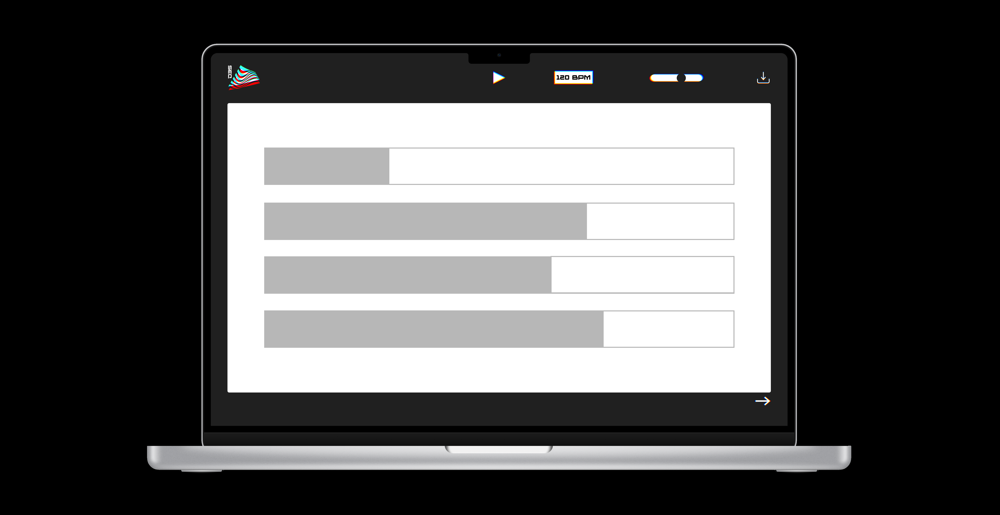

# SEQ v0.1: Browser Sequencer with an Arduino Controller

SEQ is a browser synthesizer and sequencer that I am creating using HTML, CSS, JavaScript, React, Tone.js, and Johnny-Five.js. This is my first attempt at creating a single page application and it is also my first project incorporating an Arduino. 

My intention is to create a polyphonic synth with adjustable ADSR and a 16 step sequencer with at least an octave of notes. The Arduino will be able to control things like play/pause, tempo, master volume, and a download button. It will also have an LCD to print interactions.

## Design

I was heavily inspired by some existing instruments such as the M8 Tracker, the Korg DS-10, and the Korg Gadget. I wanted my sequencer to have a gamified look and feel to it like they do. 

I knew I wasn't going to be able to accomplish something exactly like this in terms of a physical controller. Instead, I focused on the web interface and let those design decisions guide what I made for the Arduino controller. 

## Arduino Controller

The controller consists of 2 buttons, three potentiometers and one LCD screen (one potentiometer controls the contrast of the LCD). The first issue I have run into with setting up the Arduino in Johnny-Five.js is that the analog signal from the potentiometers varies quite a bit. This means that I likely can't use them to control volume and tempo. I am still in the process of figuring out what to do instead. 

## Code 

I am currently working on the code for this project. More specifically I am making the interface with React. 